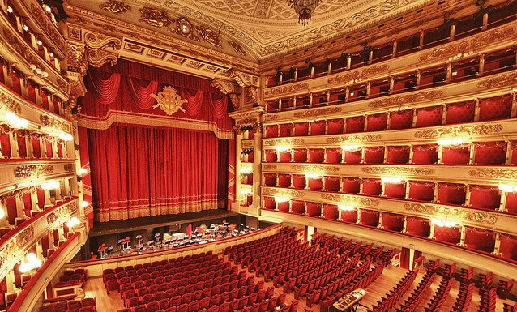

# Mouthy triangles and dancing circles

Intermediate creative coding course at Udk Berlin.

This course will explore possible narrative scenarios using code as medium.

You are going to make your own theater using only the text editor. You will set the lights, open and close the curtains, put face powder on your triangles, invite strangers on the stage and make circles dance.

The main goal of this course is to tell a story to a distracted audience.

## Organization
The course gives will take place every Friday at 14.00 in room 112. It gives 5CP. To obtain the credit points you have to take part at at least 80% of the lessons and to submit intermediate project when required.

## Topics

### Composition.
Scenes, levels, background and foreground, lights, atmosphere.

References:

[Scott Snibbe, Boundary Functions, 1998](https://www.snibbe.com/digital-art#/projects/interactive/boundaryfunctions/)
[Particular](http://funken.cl/particular/)

Addons:

[ofxAnimationPrimitives](https://github.com/edap/ofxAnimationPrimitives), [ofxLayer](https://github.com/satoruhiga/ofxLayer)

### Actors. 
Who does what? where? when? for how long?

### Time.
Beginning, end, something in between. Iterate, make loops.

Addons:

[ofxAnimationPrimitives](https://github.com/edap/ofxAnimationPrimitives)

### Movement.
Move things accordingly to the character.

References:
[Vectors](https://natureofcode.com/book/chapter-1-vectors/), [Forces](https://natureofcode.com/book/chapter-2-forces/)

Addons:

[ofxChoreograph](https://github.com/daitomanabe/ofxChoreograph), [ofxTween](https://github.com/arturoc/ofxTween)

## Lessons

- week01

Easing functions and other tools to handle movements.

- week 2

- week 3

Animated GIFS, [Golan Levin Lecture on loops](https://github.com/golanlevin/lectures/tree/master/lecture_loops)

